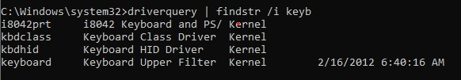

# 🛡️ Win Key Block

**Win Key Block** adalah program ringan yang ditulis dalam C++ menggunakan [Interception Driver](https://github.com/oblitum/Interception) untuk **memblokir tombol Windows (Win Key kiri)** secara permanen di level kernel.

🧠 Cocok untuk pengguna yang mengalami masalah **keyboard internal flood/tekan terus tombol Win** akibat kerusakan hardware, yang dapat menyebabkan:
- Shortcut otomatis terbuka (misalnya Win + S, Win + D)
- Input lain terganggu (tidak bisa mengetik huruf `S`, `E`, dll)
- Freeze atau bahkan **Blue Screen (BSOD)**

---

## ✨ What a program actually does?

- Blocks the **Win key** completely from the Windows system
- Operates at **kernel level which is Windows NT**
- Effectively solution for **Flooding error at fcking Win key** without disabling the internal keyboard
- And you actually can modified your own in .cpp code

---

## 📦 How to use

### 1. Install Interception Driver  
> One-time setup (Admin privileges required)
  - Download the Interception driver: [https://github.com/oblitum/Interception/releases](https://github.com/oblitum/Interception/releases)
  - Extract the files  
  - Run `install-interception.exe` as **Administrator**  
  - Restart Windows after installation

> For make sure your Interception Driver installed properly
  - Open Command Prompt
  - Type this command "driverquery | findstr /i keyb" in cmd
  - You will see "keyboard - Keyboard Upper Filter" that is Interception Driver already installed
  - 

### 2. Run `intercept.exe`

- Run `intercept.exe` normally (**no window will appear**, but it's running in the background)
- And if success it will be block you win key, if don't? You can run `intercept-debug.exe` to see your keyboard actually detect it or not
- Or build it yourself at `intercept.cpp` using `cl.exe` for compile

### 3. Run `add-to-startup.bat` (Optional)

- Run `add-to-startup.bat` to create a shortcut in the **All Users** Startup folder  
- This allows the app to automatically run every time Windows boots

---

## ⚙️ Build Manual

**Requirements:**
- Visual Studio with the **Desktop Development with C++** workload (It just for compile cpp)
- Interception SDK with:
  - `interception.h`
  - `interception.lib`  
  (Place both in the `library/` folder)

**Compile Commands:**

```bash
cl intercept.cpp /I library library\interception.lib /link /SUBSYSTEM:WINDOWS
cl intercept-debug.cpp /I library library\interception.lib


